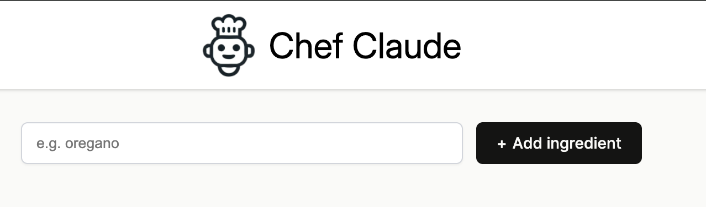

<div align="center">

# 🍳 Chef Claude

### Turn your leftover ingredients into a real recipe — powered by Claude AI


---
</div>

---

## 📸 Screenshots

<div align="center">

**Add your ingredients**



**Get an AI-generated recipe**


**Landing Page**


</div>

---

Chef Claude is a recipe generator that takes a list of ingredients you have on hand and suggests a recipe you can make with them, powered by Anthropic's Claude Haiku model.

As I start to get deeper into learning React.js I started to make some cool frontends! Hopefully I can soon add my own backend skills to make a fully functioning website by myself! Otherwise Im just focusing on frontend using react.js


## ✨ How it works

1. Enter the ingredients you have available.
2. The app sends your ingredient list to Claude (Haiku) with a prompt asking it to suggest a recipe.
3. Claude returns a recipe — formatted in Markdown — using some or all of your ingredients (it may include a few extra pantry staples if needed).
4. The recipe is rendered right on the page.

## 🛠️ Tech stack

- **React** + **Vite** for the frontend
- **@anthropic-ai/sdk** to call the Claude API
- **react-markdown** to render the returned recipe

## 🚀 Getting started

### 1. Install dependencies

```bash
npm install
```

<<<<<<< HEAD
### 2. Set up your API key

Create a `.env` file in the project root (this file is gitignored and should never be committed):

```
VITE_ANTHROPIC_API_KEY=your-api-key-here
=======
## 2. on .env (ADD THIS TO UR .ENV FILE)

```bash
DATABASE_HOSTNAME=
DATABASE_PORT=
DATABASE_PASSWORD=
DATABASE_NAME=
DATABASE_USERNAME=
ANTHROPIC_API_KEY=
>>>>>>> 0f0b39a7e60839b3706a03ee5cbe5b8625a22358
```

You can get an API key from the [Anthropic Console](https://console.anthropic.com/).

### 3. Run the app

```bash
npm run dev
```

This starts the Vite dev server. Open the local URL it prints (usually `http://localhost:5173`) in your browser.

<<<<<<< HEAD
## 🔑 A note on API keys

This project calls the Anthropic API directly from the browser (`dangerouslyAllowBrowser: true`), which means the API key is bundled into the client-side JavaScript. **This is fine for local development, but it is not safe to deploy publicly as-is** — anyone visiting a live, deployed version of this site could inspect the page and find your API key.

To deploy this safely, the API call should be moved behind a small backend (e.g. an Express server) that keeps the API key server-side and exposes your own `/api` endpoint for the frontend to call instead.
=======
## 🔑 A note on .env (ADD THIS TO UR .ENV FILE)

```bash
DATABASE_HOSTNAME=
DATABASE_PORT=
DATABASE_PASSWORD=
DATABASE_NAME=
DATABASE_USERNAME=
ANTHROPIC_API_KEY=
```
>>>>>>> 0f0b39a7e60839b3706a03ee5cbe5b8625a22358

## 📜 Available scripts

| Command | Description |
|---|---|
| `npm run dev` | Starts the Vite development server |
| `npm run build` | Builds the app for production |
| `npm run preview` | Previews the production build locally |
<<<<<<< HEAD
=======
| ` uv run uvicorn main:app --reload` | Runs the backend (MUST BE ON DIR OF backend)|
>>>>>>> 0f0b39a7e60839b3706a03ee5cbe5b8625a22358
